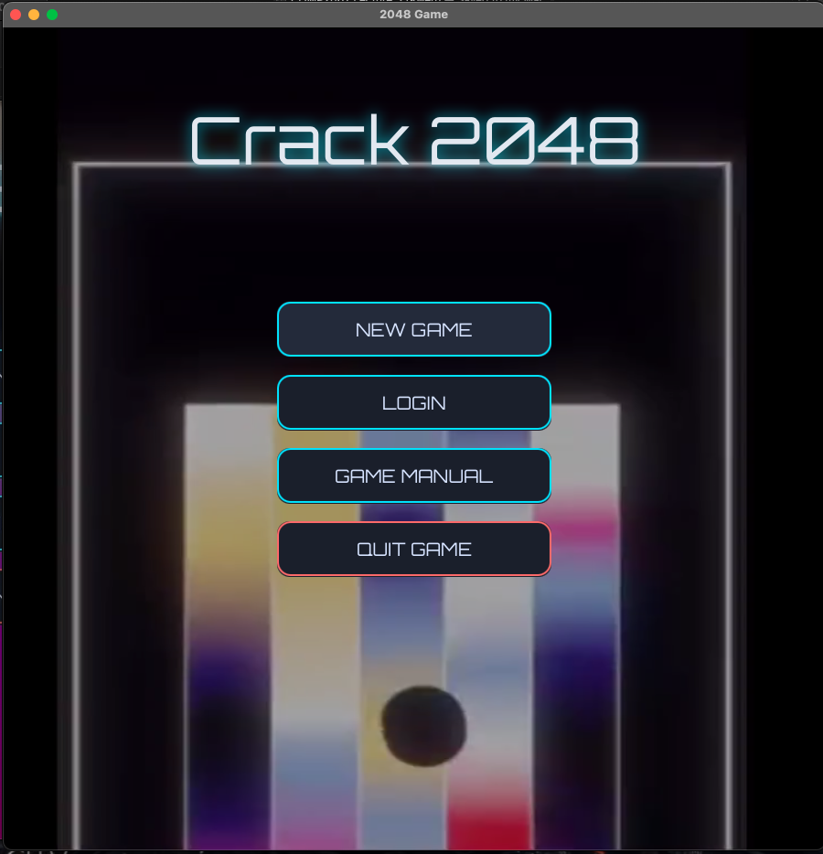
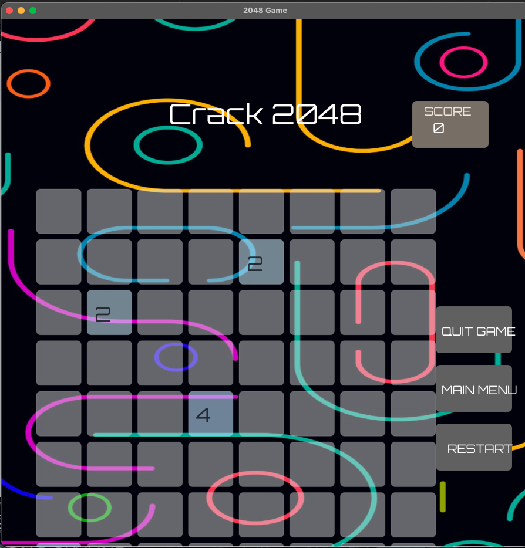
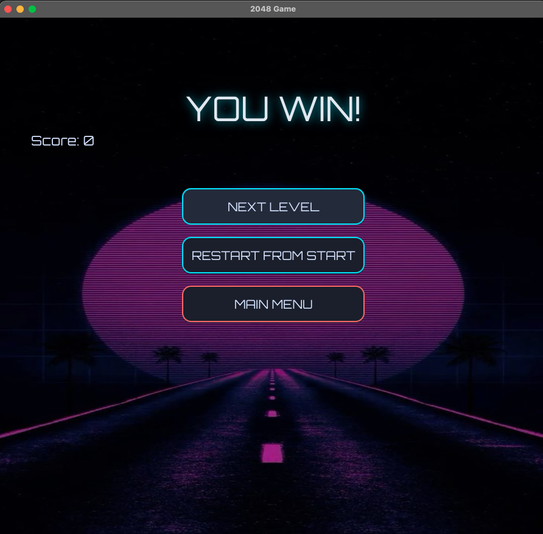

# CW2024 Project Documentation

## Table of Contents

1. [GitHub Repository Link](https://github.com/ImpactGLX323/CW2024R)
2. [Introduction](#2-introduction)
3. [Project Goals](#3-project-goals)
4. [Project Structure](#4-project-structure)
5. [Project Prerequisites](#5-project-prerequisites)
6. [Project Running and Compilation](#6-project-running-and-compilation)
7. [Implemented Features and Working Properly](#7-implemented-features-and-working-properly)
8. [Features Implemented but Not Working Properly](#8-features-implemented-but-not-working-properly)
9. [Features Not Working](#9-features-not-working)

---

## 1. GitHub Repository Link

[**CW2024 Repository**](https://github.com/your-username/CW2024R)

---

## 2. Introduction

This project represents the work of Abdullah Sami Bin Mamun, Student ID:20614435. The project is modelled after the 2048 game hence named _CRACK-2048_.

Provided the initial source code the game has been upgraded to feature more levels and ensure enhance graphics and UI to stimulate gaming experience.

---

## 3. Project Goals

- Make the game playable and more interesting,
- Solve all issues regarding the gameplay and ensure user has a smooth gameplay experience
- Enhanced UI and graphics making the game more comprehensive and interesting.
- Implement game features and ensure that they work.

---

## 4. Project Structure

**Root Structure of `CW2024R`:**

```plaintext
CW2024R/
│── docs/                         # Documentation and diagrams (Javadoc, UML, etc.)
│
│── src/
│   ├── main/
│   │   └── java/
│   │       └── com/
│   │           └── example/
│   │               └── demo/
│   │                   │── Main.java
│   │                   │── Account.java
│   │                   │── Cell.java
│   │                   │── Controller.java
│   │                   │── EndGame.java
│   │                   │── GameScene.java
│   │                   │── module-info.java
│   │
│   │                   ├── utils/
│   │                   │    └── TextMaker.java
│   │
│   │                   └── view/
│   │                        └── MainMenu.java
│
│   ├── test/
│   │   └── java/
│   │       └── com/
│   │           └── example/
│   │               └── demo/
│   │                   │── MainTest.java
│   │                   │── GameSceneTest.java
│
│── pom.xml                      # Maven configuration file
│── README.md                    # Project documentation
│── .gitignore                   # Git ignore rules
```

---

---

## 5. Project Prerequisites

Before running the project, ensure you have:

- **Java:** JDK 21 or higher
- **JavaFX SDK:** 21.0.2 (handled automatically by Maven if you use `mvn javafx:run`)
- **Maven:** 3.9+ installed and on your PATH
- **IDE:** IntelliJ IDEA _or_ VS Code (with Java & Maven extensions)
- **Graphviz (optional):** only if you want to render UML locally

> Tip: verify your toolchain:
>
> ```bash
> java -version
> mvn -v
> ```

---

## 6. Project Running and Compilation

### A) Get the source

**Option 1 — Git clone (recommended):**

```bash
git clone https://github.com/<your-user>/CW2024R.git
cd CW2024R
```

2. Open the cloned folder in IntelliJ IDEA or VS Code.
3. Let Maven automatically download dependencies from pom.xml.

Alternatively, run:

```bash
mvn clean install
```

4. Configure JavaFX SDK in your IDE settings:
   - VS Code: Install the “Java Extension Pack” and “JavaFX Support” extensions.
   - IntelliJ IDEA: Add JavaFX SDK in Project Structure → Libraries.
5. Run Main.java to start the application.

## or

```
mvn clean javafx:run
```

**Option 2 — Download ZIP:**

1. Go to the GitHub repository.
2. Click the green Code button → Download ZIP.
3. Extract the ZIP file to your preferred location.
4. Open the folder in IntelliJ IDEA or VS Code.
5. Let Maven install dependencies via pom.xml (or run mvn clean install).
6. Configure JavaFX SDK in your IDE (as in Option 1).
7. Run Main.java to launch the game.

```
mvn clean javafx:run
```

**Option 3 — Github Desktop:**

1. Go to the GitHub repository.
2. Click the green Code button → Clone Project and download ZIP
3. Extract the ZIP file to your preferred location.
4. Open Github Desktop and load the project, open in VScode
5. Let Maven install dependencies via pom.xml (or run mvn clean install).
6. Configure JavaFX SDK in your IDE (as in Option 1).
7. Run Main.java to launch the game or

```
mvn clean javafx:run
```

---

## 7. Implemented Features and Working Properly

| Feature Name                       | Reason                                                                              | Implementation                                                                                                                                             |
| ---------------------------------- | ----------------------------------------------------------------------------------- | ---------------------------------------------------------------------------------------------------------------------------------------------------------- |
| **1. Main Menu at the start**      | Allows user to select options before randomly starting the game                     | Done through a new class called `MainMenu.java`. <br>                                                   |
| **2. Multiple Levels**             | Single level is monotonous for the user                                             | Implemented three levels: 4x4, 8x8, 10x10 grids. <br>                                                   |
| **3. Responsive UI**               | Previous UI was not responsive and not playable                                     | Used `contentLayer` to implement responsive UI in all game levels. No problems during minimisation.                                                        |
| **4. Enhanced Graphics**           | Previous version lacked proper graphics, fonts, and themes                          | Added video backgrounds for the Main Menu and themed backgrounds for Win Game, End Game, and each level.                                                   |
| **5. Enhanced Cell/Tile Movement** | Previous tile movements had inconsistent colours, reducing the game’s visual appeal | Updated the colour schemes and tile fonts, made them transparent to blend with the background.                                                             |
| **6. Restart Option**              | No restart option existed, reducing gaming experience                               | Restart option added, allowing users to restart from any level.                                                                                            |
| **7. Main Menu Return Option**     | No way to navigate back to Main Menu during a game                                  | Users can now navigate to the main menu from anywhere in the game.                                                                                         |
| **8. Functional Quit Game**        | Quit Game was previously non-functional and caused crashes                          | Quit Game now works without crashes, allowing a safe exit from the game.                                                                                   |
| **9. Game Over Screen**            | Previous Game Over screen was not user friendly                                     | Added a user-friendly Game Over screen with functional options for Main Menu, Restart, and Quit.                                                           |
| **10. Win Game Screen**            | No notification when the game was won                                               | Added Win Game screen notifying the user, with options to Restart, return to Main Menu, or Quit. <br>  |

---

## 8. Features Implemented but Not Working Properly

| Feature Name                      | Issue                                                                                                                               |
| --------------------------------- | ----------------------------------------------------------------------------------------------------------------------------------- |
| Layout Problems in Level Two      | The bottom grids cannot be seen properly in Level Two which is an issue that needs to be resolved                                   |
| Return to New Game from Level Two | The user when halts the game from Level 2 and wants to go back to Level 1 (New Game) the user is sent back to Level 2 instead of 1. |
| LoginMessage                      | Implemented but not loading due to logic issues in code                                                                             |
| ManualMessage                     | Implemented but not loading due to logic issues in code                                                                             |

---

## 9. Features Not Working

| Feature Name | Reason                         |
| ------------ | ------------------------------ |
| Account      | Account status not implemented |
| Login        | Login not implemented          |
| Manual       | Manual not implemented         |

## 10. UML Class Diagram

The class diagram for the project is shown below. Click to open full size.

[](docs/class-diagram/class-diagram.png)
